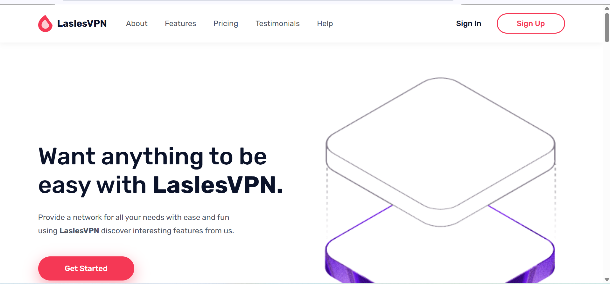

# LaslesVPN — Landing Page

A pixel-faithful React implementation of the [LaslesVPN Figma design](https://www.figma.com/design/9PgUPbXQiq2blWwFoC9RyC/FREEBIES-Landingpage-LaslesVPN--Community-).



## Tech Stack

- **React 19** + **TypeScript** + **Vite 8** (Rolldown bundler)
- **Framer Motion v11** — scroll-triggered animations, staggered children, SVG pulse rings
- **d3-geo** + **topojson-client** — real Natural Earth world map (110m resolution)
- **Rubik** — Google Font

## Features

- Fully responsive layout
- Animated Navbar, Hero (floating image + count-up stats), Features, Pricing cards, Testimonials carousel, Network world map, CTA, Footer
- Pulsing VPN location markers across 15 global cities
- Production build: `npm run build`

## Getting Started

```bash
npm install
npm run dev
```

Open [http://localhost:5173](http://localhost:5173).
